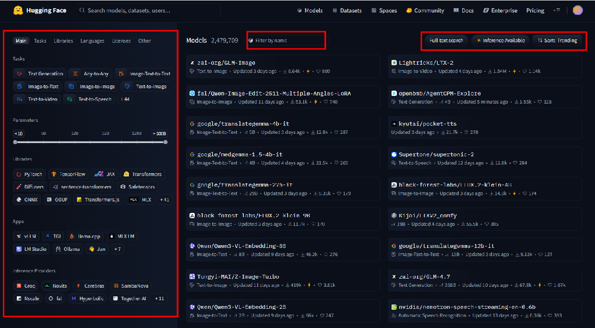
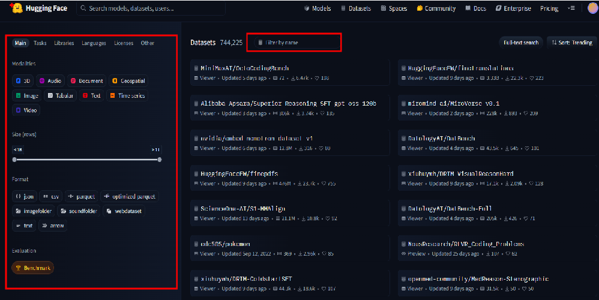
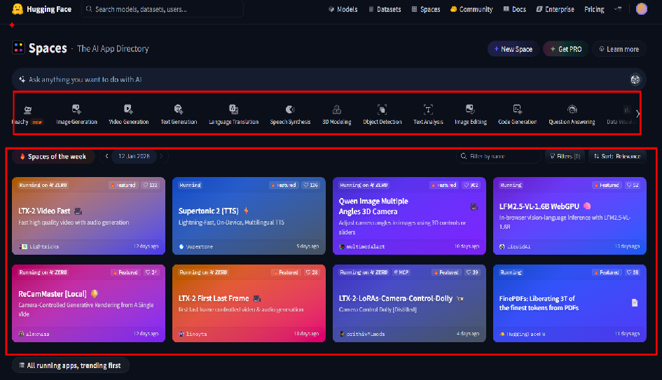
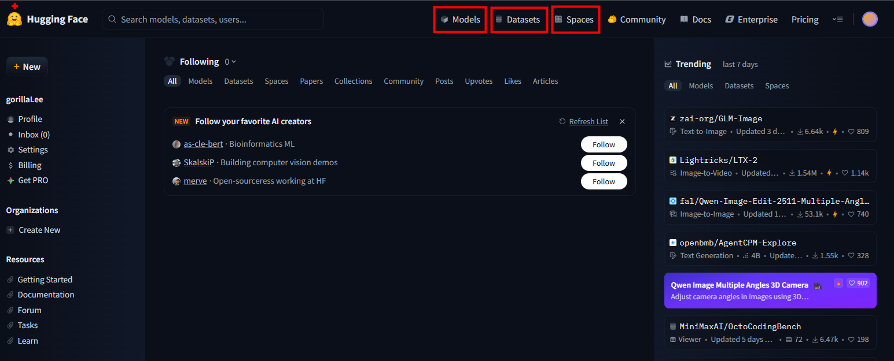
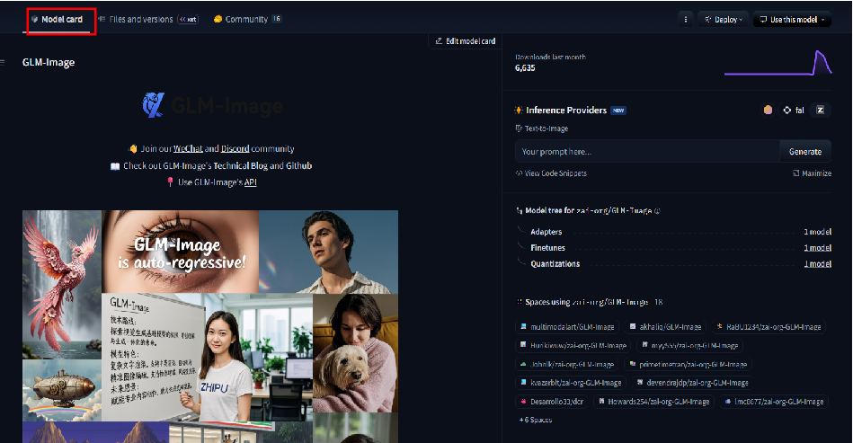

## 📚 Chapter 01. 허깅페이스 생태계와 핵심 아키텍처 - 섹션 1.1 Hugging Face Hub와 Model Card

### 🎬 도입 스토리: "거인의 어깨 위에 올라타는 법" 

민수는 드디어 비동기 서버 엔진을 완성했습니다. 이제 그 엔진에 실을 진짜 '인공지능 모델'이 필요합니다. 하지만 민수는 고민에 빠졌습니다. "현우님, 감성 분석 모델을 만들려면 제가 직접 수천만 개의 문장을 수집해서 학습시켜야 하나요? GPU 서버도 한 대뿐인데, 모델 학습에만 몇 달이 걸릴 것 같아요."

시니어 개발자 현우님이 민수의 모니터에 한 웹사이트를 띄워주며 말합니다. "민수 씨, 현대 소프트웨어 개발의 핵심은 '바퀴를 다시 발명하지 않는 것'입니다. 우리가 오픈소스 라이브러리를 가져다 쓰듯, 인공지능 모델도 이미 전 세계 천재들이 학습시켜 놓은 것을 가져다 쓸 수 있어요. 그 보물창고가 바로 **Hugging Face Hub** 입니다."

현우님은 이어서 덧붙입니다. "하지만 단순히 모델을 다운로드하는 게 전부는 아니에요. 이 모델 파일들이 수 기가바이트(GB)에 달하기 때문에, 이를 어떻게 효율적으로 관리하고 메모리에 올리는지가 중요합니다. 무턱대고 받다가는 민수 씨의 RTX 4080 하드디스크가 금방 가득 차버릴 거예요. 오늘은 AI 모델의 유통망인 Hub와 이를 다루는 도구인 **Transformers** 의 내부 동작 원리를 깊이 있게 파헤쳐 봅시다."


---

### [Hugging Face Hub](https://huggingface.co/): AI 세계의 GitHub 
Hugging Face Hub는 코드의 GitHub와 같습니다. 하지만 코드를 넘어 **Model, Dataset, Space(데모)** 라는 세 가지 핵심 요소를 관리합니다.

1. Model: 학습된 가중치(Weights)와 설정 파일(Config).
    - Task : 해결 하려는 문제 유형 (예: 텍스트 분류, 번역, 요약 등)를 중심으로 필터링 할 수 있다
   
   
2. Dataset: 모델을 학습시키거나 평가하기 위한 데이터 뭉치.
    - Task : 모델과 마찬가지로 문제 유형별로 필요한 데이터 셋이 구축되어 있으며 필터링 할 수 있다.
    
   
3. Space: 모델을 즉시 테스트해 볼 수 있는 웹 런타임 환경.
    - Task별로 모델을 시연해 볼 수 있는 데모 애플리케이션이 구축되어 있다.
    




### Model Card: AI 모델의 취급 설명서
Hugging Face Hub에 업로드된 모델은 **Model Card** 라는 메타데이터 파일을 포함합니다. <br>
이러한 메타데이터는 모델의 특성, 사용법, 학습 데이터, 라이선스, 한계점 등을 상세히 설명하는 '취급 설명서' 역할을 합니다. <Br>
모델 배포시 이러한 카드가 반드시 포함되어야 하며, 개발자는 코드를 짜기 전 모델 카드를 보고 우리가 서비스하려는 목적(라이선스 등)에 맞는지 반드시 확인합니다.




### Hugging Face Hub의 핵심 기술: Git-LFS (Large File Storage)
AI 모델은 파일 하나가 수 GB를 넘습니다. Git은 원래 텍스트 관리에 최적화되어 있어 큰 파일을 다루기 힘든데, HF Hub는 LFS라는 기술을 써서 대용량 바이너리 파일을 효율적으로 버전 관리합니다. <br>
github의 핵심 철학은 "모든 히스토리를 모든 클라이언트가 공유한다."는 것이지만, 이는 100MB의 바이너리 파일을 10번 수정하면, 레포의 크기가 1GB가 된다는 뜻이기도 합니다. <br>

Git-LFS는 이러한 문제를 해결하기 위해 고안된 방식으로 아래와 같은 매너니즘을 가집니다.

1. 포인터 파일 생성: 실제 대용량 파일 대신, 텍스트로 된 아주 작은 포인터 파일만 Git 레포지토리에 저장됩니다.
2. 데이터 저장소 분리: 실제 바이너리 데이터는 Git 서버가 아닌 **LFS 전용 스토리지(HTTPS)**에 저장됩니다.
3. 지연 로딩 (Lazy Loading): git checkout을 할 때, LFS는 현재 내가 작업하려는 브랜치에 필요한 버전의 파일만 스토리지에서 즉시 다운로드하여 워크스페이스를 채웁니다.

### 내부 동작 원리와 OS/파일 시스템

**A. 모델 캐싱 시스템과 심볼릭 링크(Symbolic Link)** <br>
Hugging Face 라이브러리를 쓰면 모델을 매번 다운로드하지 않습니다. 여기에 OS 레벨의 영리한 트릭이 숨어 있습니다.

1. **Blob 저장소:** 모델 파일은 시스템의 공용 캐시 폴더(주로 `~/.cache/huggingface/hub`)에 복잡한 해시 이름으로 저장됩니다.

2. **Snapshot:** 특정 버전의 모델을 호출하면, HF는 실제 파일(Blob)을 복사하는 대신 **심볼릭 링크**를 생성하여 마치 현재 폴더에 파일이 있는 것처럼 보여줍니다.

3. **이점:** 같은 모델을 여러 프로젝트에서 사용해도 실제 물리적 공간은 딱 한 번만 차지합니다. 이는 UV 패키지 매니저가 하드 링크를 쓰는 원리와 매우 유사한 **공간 최적화 전략**입니다.

**B. Transformers Library: 추상화의 예술** <br>
전 세계에는 PyTorch, TensorFlow, JAX 등 다양한 딥러닝 프레임워크가 있습니다. Transformers 라이브러리는 이를 하나로 묶어주는 **어댑터(Adapter)** 역할을 합니다.

> [!note]
> PyTorch : Facebook에서 개발한 딥러닝 프레임워크로, 동적 계산 그래프와 직관적인 API로 연구자와 개발자들 사이에서 인기가 높습니다. <br>
> TensorFlow : Google에서 개발한 딥러닝 프레임워크로, 대규모 분산 학습과 생산 환경 배포에 강점을 가지고 있습니다. <br>
> JAX : Google에서 개발한 고성능 수치 계산 라이브러리로, 자동 미분과 GPU/TPU 가속에 최적화되어 있습니다.


* **Auto-Class 시스템:** 모델의 이름(`bert-base-uncased` 등)만 주면, 라이브러리가 자동으로 해당 모델의 아키텍처를 파악하여 적절한 클래스를 메모리에 인스턴스화합니다. 이것은 객체 지향의 **팩토리 패턴(Factory Pattern)**이 극대화된 형태입니다.
  
* **Pipeline API:** 복잡한 전처리(Tokenizer), 추론(Model), 후처리(Post-process) 과정을 단 한 줄의 코드로 연결해 주는 **퍼사드 패턴(Facade Pattern)**의 정수입니다.

### 주의사항 및 베스트 프랙티스

* **라이선스 확인:** `Apache 2.0`은 상업적 이용이 자유롭지만, 일부 모델은 `CC-BY-NC`(비영리 전용) 등을 가집니다. 기업 서비스에 무턱대고 쓰면 법적 문제가 발생합니다.
* **로컬 캐시 관리:** 모델을 너무 많이 받으면 디스크가 꽉 찹니다. `huggingface-cli delete-cache` 명령어를 통해 주기적으로 관리하는 습관이 필요합니다.
* **버전 고정:** Hub의 모델은 업데이트될 수 있습니다. 프로덕션 환경에서는 특정 `revision`(해시값)을 명시하여 모델 업데이트로 인한 결과값 변화를 방지해야 합니다.

---

## 실습 하기

### 환경 설정
```bash
uv add transformers huggingface_hub pillow
```

### MobileNetV2 모델을 허깅페이스 허브 호출
1. `MobileNetV2` 검색
2. `mobilenet_v2_1.0_224` 모델 선택
3. `Use in Transformers` 탭 클릭
4. `transformers` 코드 복사 후 실행
   - 1번 고수준 API 사용하기


```python
# Use a pipeline as a high-level helper
from transformers import pipeline

pipe = pipeline("image-classification", model="google/mobilenet_v2_1.4_224")
pipe("https://huggingface.co/datasets/huggingface/documentation-images/resolve/main/hub/parrots.png")
```

---

### 🎓 핵심 요약 

이번 섹션에서 배운 것:
* **Hugging Face Hub:** AI 모델의 중앙 저장소이며, 모델 카드와 Git-LFS를 통해 모델을 관리합니다.
  
* **캐싱 메커니즘:** OS의 심볼릭 링크를 활용해 중복 다운로드를 방지하고 디스크 공간을 최적화합니다.
  
* **Transformers Pipeline:** 복잡한 AI 추론 과정을 단 한 줄로 추상화하여 개발 생산성을 높입니다.
  
* **메모리 관리 기초:** 모델은 전역적으로 로드하여 재사용(Singleton)해야 하며, 로딩 시 발생하는 오버헤드를 이해했습니다.
