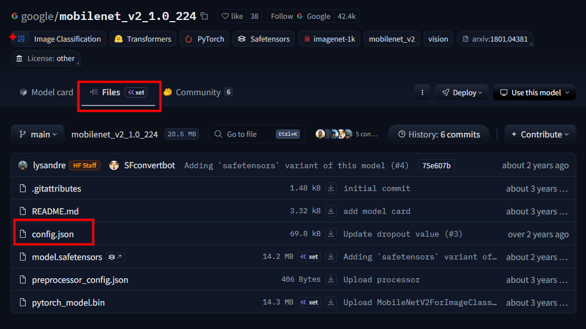

## 📚 Chapter 01. 허깅페이스 생태계와 핵심 아키텍처 - 섹션 1.2 Auto-Class 시스템 (Factory Pattern)

### 🎬 도입 스토리

여러분, 만약 허깅페이스에 있는 100만 개의 모델마다 우리가 각기 다른 클래스를 불러와야 한다면 어떨까요?

"이 모델은 BERT니까 BertModel을 임포트하고... 아, 저 모델은 GPT-2니까 GPT2Model을 써야 하네? 잠깐, 이건 RoBERTa잖아! RobertaModel은 또 어디 있지?"

코드는 금방 스파게티처럼 꼬일 것이고, 모델 하나를 교체할 때마다 수십 줄의 코드를 수정해야 할 겁니다. 실제 실무 프로젝트에서 모델 아키텍처는 수시로 바뀝니다. 어제는 BERT가 최고였지만 오늘은 RoBERTa가 더 나을 수 있죠. 시니어 개발자는 이런 변화에 유연하게 대처하기 위해 **"추상화(Abstraction)"** 라는 무기를 꺼냅니다.

허깅페이스는 이 문제를 **Factory Pattern(팩토리 패턴)** 이라는 고전적이지만 강력한 디자인 패턴으로 해결했습니다. 우리는 from_pretrained()라는 마법 같은 메서드 하나로 이 모든 복잡성을 감춥니다. 오늘 우리는 그 마법의 커튼 뒤를 열어볼 것입니다.

---

### 디자인 패턴의 정수: Factory Pattern

팩토리 패턴은 **"객체 생성을 직접 하지 않고 공장(Factory)에 맡긴다"** 는 개념입니다.

* **Client (개발자)**: "나는 'bert-base-uncased'라는 이름의 모델 객체가 필요해."
  
* **Factory (Auto-Class)**: "알겠어. 내가 내부 정보를 확인해 보니 이건 BERT 구조네. `BertModel` 클래스를 찾아서 인스턴스를 만들어 줄게."

이 과정 덕분에 개발자는 구체적인 클래스명(Concrete Class)을 몰라도 모델 이름(Identifier)만 알면 모델을 사용할 수 있게 됩니다.

### `from_pretrained()`의 내부 동작 원리

`AutoModel.from_pretrained("model_name")`이 호출되면 내부적으로 다음과 같은 **메모리 및 실행 흐름**이 발생합니다.


**Step 1: 설정 파일(config.json)의 선행 다운로드** <br>
가장 먼저 가중치 파일(`.bin`이나 `.safetensors`)을 받지 않습니다. 모델의 명세서인 `config.json`만 먼저 가져옵니다. 이 파일은 수 KB에 불과해 매우 빠릅니다.



**Step 2: 아키텍처 식별 (The Mapping)** <br>
`config.json` 안에는 `model_type`이라는 필드가 있습니다.

```json
{
  "model_type": "mobilenet_v2", // 모델의 아키텍처 유형
  "architectures": ["MobileNetV2ForImageClassification"], // 권장 아키텍처 클래스
  ...
}
```

허깅페이스 라이브러리 내부에는 `{"mobilenet_v2": MobileNetV2ForImageClassification, "mobilenet_v1": MobileNetV1ForImageClassification, ...}` 형태의 거대한 **Registry(등록부)** 가 존재합니다. 여기서 "mobilenet_v2"라는 키워드를 보고 어떤 클래스를 생성할지 결정합니다.

**Step 3: 동적 인스턴스화 (Dynamic Instantiation)** <br>
결정된 클래스(예: `BertModel`)의 `__init__` 메서드가 호출됩니다. 이때 `config.json`에 정의된 하이퍼파라미터(레이어 수, 헤드 수 등)가 메모리에 할당됩니다.

>[!note]
> `config.json`의 역할 <br>
> `config.json` 파일은 모델의 아키텍처와 하이퍼파라미터를 정의하는 메타데이터입니다. 이 파일을 통해 모델의 구조를 이해하고, 올바른 클래스와 설정으로 인스턴스를 생성할 수 있습니다. <br>
> 모델의 구조를 결정하는 단계에서 레이어 수, 히든 크기, 어텐션 헤드 수, 활성화 함수, 드롭아웃 비율 등 다양한 구조를 정의하게 되는데, 이러한 정보는 모두 `config.json`에 포함되어 있습니다.

**Step 4: 가중치 바인딩 (Weight Loading)** <br>
마지막으로 실제 수백 MB의 가중치 데이터를 메모리에 로드하여 앞서 생성된 모델 구조에 주입(Inject)합니다.

#### 3. 메모리 관점에서의 전략
* **Lazy Loading**: 모든 모델 구조를 미리 메모리에 올려두지 않습니다. 필요한 순간에 `config.json`을 읽고 해당 클래스만 동적으로 Import 합니다.
  
* **Memory Mapping (mmap)**: 최신 허깅페이스 모델들은 가중치를 로드할 때 전체를 RAM에 올리는 대신, 디스크의 파일을 메모리 주소 공간에 매핑하는 방식을 사용하여 초기 로딩 속도와 메모리 효율을 극대화합니다.

>[!note]
> Memory Mapping <br>
> Memory Mapping은 대용량 파일을 메모리에 직접 로드하지 않고, 디스크의 파일을 가상 메모리 주소 공간에 매핑하는 기술입니다. <br>이 방식을 사용하면, 필요한 데이터만 메모리에 로드되므로 초기 로딩 시간이 단축되고, 전체 메모리 사용량이 줄어듭니다. <br>
> mmap 방식 (Memory Mapping)
> - OS(운영체제)에게 "이 10GB짜리 파일이 메모리 주소 0x100번부터 시작한다고 치자"라고 선언만 합니다.
> - 실제로 복사는 일어나지 않습니다. CPU는 해당 데이터가 이미 메모리에 있는 것처럼 행동합니다.

### 주의사항 및 베스트 프랙티스

* **AutoClass의 한계**: 아주 특수한 커스텀 모델의 경우 `AutoModel`이 인식하지 못할 수 있습니다. 이때는 `trust_remote_code=True` 옵션을 사용해야 하는데, 이는 보안상 위험할 수 있으므로(신뢰할 수 없는 코드가 실행됨) 실무에서는 내부 코드를 반드시 검토해야 합니다.

* **명시적 태스크 선택**: `AutoModel`보다는 `AutoModelForSequenceClassification`처럼 자신의 목적(Task)에 맞는 전용 Auto 클래스를 사용하는 것이 좋습니다. 그래야 모델 뒤에 적절한 'Head'(분류기 등)가 자동으로 붙습니다.


---

### 🎓 핵심 요약

**이번 섹션에서 배운 것:**

1. **Factory Pattern의 구현**: `AutoModel` 클래스는 `config.json`을 분석하여 적절한 구체 클래스를 동적으로 생성해 주는 공장 역할을 수행합니다.
2. **코드의 유연성**: 특정 아키텍처에 종속되지 않는 코드를 작성함으로써 모델 교체 비용을 획기적으로 낮출 수 있음을 배웠습니다.
3. **내부 로직 흐름**: `Config 로드 → 아키텍처 식별 → 클래스 매핑 → 인스턴스화 → 가중치 로드`로 이어지는 5단계 프로세스를 이해했습니다.
