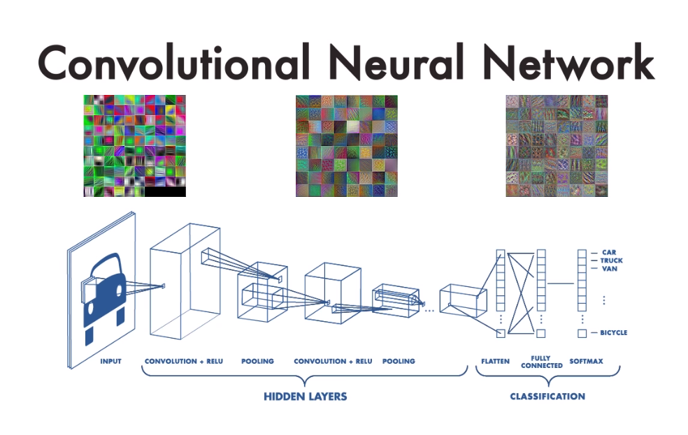
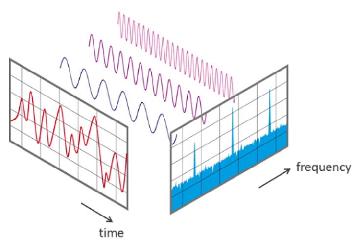
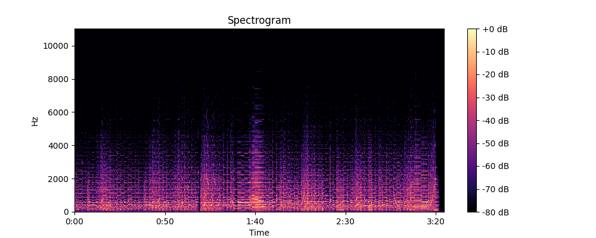

## 📚 Chapter 02. Task별 실전 인퍼런스 마스터 - 섹션 2.3 Computer Vision & Audio 실습

### 🎬 도입 스토리 

여러분이 무인 편의점의 보안 시스템을 구축하는 리드 개발자라고 가정해 봅시다. 텍스트만 처리하던 이전 시스템과 달리, 이제는 '눈'과 '귀'가 필요합니다. CCTV 화면에서 누군가 물건을 주머니에 넣는지 감시해야 하고(객체 탐지), 매장 내 키오스크에서 "도와주세요!"라는 고객의 외침을 알아들어야 합니다(음성 인식).

이런 멀티모달(Multimodal) 프로젝트를 맡게 되면 주니어들은 보통 "OpenCV를 써야 하나? 음성 처리는 FFmpeg인가?"라며 도구의 늪에 빠집니다. 하지만 개발자는 데이터의 **'통일된 규격'** 에 집중합니다. 이미지든 소리든 결국 모델에 들어갈 때는 숫자로 채워진 **'텐서(Tensor)'** 가 되어야 한다는 본질을 꿰뚫고 있죠.

오늘은 Hugging Face가 이 이질적인 데이터들을 어떻게 텍스트와 똑같은 방식으로 요리하는지, 그리고 실무에서 Vision과 Audio 모델을 돌릴 때 반드시 고려해야 할 '하드웨어 리소스'와 '샘플링'의 비밀을 파헤쳐 보겠습니다.

> [!note]
> OpenCV, FFmpeg  
> OpenCV는 이미지 및 비디오 처리에 특화된 오픈소스 라이브러리입니다. FFmpeg는 오디오 및 비디오 파일의 변환, 스트리밍, 녹화에 널리 쓰이는 툴킷입니다. 오늘날 많은 멀티미디어 애플리케이션에서 핵심 구성 요소로 활용되고 있습니다.

---

### 이미지와 소리를 숫자로 바꾸는 법

텍스트에 'Tokenizer'가 있다면, 이미지와 오디오에는 **'Image Processor'** 와 **'Feature Extractor'** 가 있습니다.

#### **Vision**
컴퓨터 비전 모델에게 이미지는 단순한 시각 정보가 아니라, 수치화된 **다차원 행렬(Tensor)** 입니다.  기본 단위인 픽셀은 가로, 세로 좌표 위에서 R(Red), G(Green), B(Blue) 세 가지 채널의 강도를 0~255 사이의 정수로 나타냅니다. 즉, $224 \times 224$ 크기의 컬러 이미지는 실제로는 $224 \times 224 \times 3$이라는 약 15만 개의 숫자로 이루어진 데이터 덩어리인 셈입니다. 모델이 이 거대한 데이터를 오차 없이 학습하기 위해서는 두 가지 핵심 과정이 필요합니다. 
- 리사이징(Resizing)과 보간법 : 모델의 입력 레이어(Input Layer)는 <mark>고정된 크기</mark>만 받도록 설계되어 있습니다. 다양한 크기의 사진을 일정한 규격(예: 224x224)으로 맞출 때, 픽셀 사이의 빈 공간을 수학적으로 채워넣는 **보간법(Interpolation)** 을 사용하여 이미지 왜곡을 최소화합니다.
  
- 수치적 안정성을 위한 정규화: 0~255 범위의 픽셀 값은 딥러닝 연산 과정에서 값이 너무 커져 학습이 불안정해지는 <mark>'기울기 폭주'</mark>를 야기할 수 있습니다. 이를 방지하기 위해 0~1 사이로 압축하거나, 아래와 같이 데이터셋의 평균($\mu$)과 표준편차($\sigma$)를 활용해 표준화합니다. 

>[!note]
> 컨볼류션 신경망 (Convolutional Neural Network, CNN)  
> **컨볼루션 레이어(Convolutional Layer)** 는 합성곱 신경망(CNN)의 가장 핵심적인 구성 요소로, 이미지나 데이터에서 중요한 '특징(Feature)'을 추출하는 필터 역할을 합니다.
> 컨볼루션 레이어는 커널(Kernel) 또는 **필터(Filter)** 라고 불리는 작은 행렬을 이미지 위에서 일정한 간격으로 이동시키며 연산을 수행합니다.
>
> - 합성곱 연산: 필터가 이미지의 특정 영역 위에 놓이면, 겹치는 부분의 수치들을 서로 곱하고 모두 더합니다. 이 결과값 하나가 새로운 지도의 한 칸이 됩니다.
>
> - 특징 지도(Feature Map) 생성: 필터가 전체 이미지를 훑고 지나가면, 특정 패턴(예: 가로선)이 강조된 새로운 행렬인 '특징 지도'가 만들어집니다

> [!tip] 참고 하기
>  [computer vision](https://adamharley.com/nn_vis/cnn/3d.html)  
>  [원리 파악하기](https://youtu.be/sO8AQtlOj8c)

#### **Audio**
오디오는 본질적으로 시간에 따라 변화하는 공기의 진동인 **아날로그 파형(Waveform)** 입니다.  컴퓨터는 연속적인 아날로그 신호를 직접 처리할 수 없으므로, 이를 일정한 시간 간격으로 쪼개어 수치화하는 샘플링(Sampling) 과정을 거칩니다. 1초당 샘플링 횟수를 의미하는 **샘플링 레이트(Sampling Rate)** 가 높을수록 원음에 가까운 복원이 가능하며, 일반적으로 음성 인식 모델에서는 효율성을 위해 16,000Hz(1초에 16,000번 기록)를 표준으로 사용합니다.   즉, 1초 길이의 오디오 클립은 16,000개(샘플링 값)로 구성된 1차원 배열(Tensor)로 표현됩니다.

단순히 시간 순서대로 기록된 파형 데이터(Raw Waveform)는 모델이 정보의 패턴을 찾기에 너무 복잡하고 데이터량이 방대합니다. 따라서 오디오 데이터를 주파수 영역으로 변환하는 전처리가 필수적입니다.

- 푸리에 변환(STFT): 복합적인 진동을 여러 주파수 성분으로 분해하여 시간-주파수 평면의 **스펙트로그램(Spectrogram)** 으로 변환합니다.
    
    

    - x축: 시간 (Time)을 기준으로 나누어진 구간
    - y축: 주파수 (Frequency) 성분 샘플링된 시간에서 개별 주파수의 세기(Amplitude)를 나타냄
  

- 멜-스펙트로그램(Mel-Spectrogram): 인간의 귀가 저주파수는 민감하게, 고주파수는 둔감하게 반응하는 특성을 반영하여 주파수 축을 재조정합니다.

    
            
        - 어두운 부분: 낮은 에너지(소리 크기)
        - 밝은 부분: 높은 에너지(소리 크기)

이러한 과정을 통해 1차원의 소리 파형은 2차원의 이미지 형태(Mel-spectrogram)로 재구성됩니다. 결과적으로 오디오 모델은 이 '소리의 이미지'를 CNN이나 Transformer 구조로 학습하여, 음성 속의 단어나 화자의 감정, 주변 소음의 정체 등을 정확하게 파악할 수 있게 됩니다.

### 내부 동작 원리

**A. Vision: 픽셀에서 특징(Feature)으로**  
모델이 사진 속 '고양이'를 찾는 과정은 픽셀의 단순 나열을 보는 게 아닙니다.

* **데이터 파이프라인**: `이미지 파일(JPG/PNG) -> 픽셀 배열(Numpy/PIL) -> 정규화 및 크기 조정 -> 텐서(Tensor)`
  
* **메모리 관점**: 이미지는 텍스트보다 훨씬 많은 메모리를 점유합니다. 예를 들어 1080p 이미지는 약 600만 개의 숫자로 이루어져 있습니다. 시니어 개발자는 이를 처리할 때 **'메모리 정렬(Memory Alignment)'** 과 **'배치 크기(Batch Size)'** 조절을 통해 GPU VRAM이 터지는(OOM) 상황을 방지합니다.
  

**B. Audio: 주파수의 마법**  
음성 인식(STT) 모델은 소리 파형을 그대로 쓰기도 하지만, 많은 경우 **'스펙트로그램(Spectrogram)'** 이라는 시각적 이미지로 변환하여 처리합니다.

* **Sampling Rate (SR)**: 초당 몇 번 소리를 추출하느냐입니다. 실무에서 가장 흔한 실수는 모델은 16kHz(초당 16,000번)로 학습되었는데, 마이크는 44.1kHz로 녹음하는 경우입니다. 이 불일치는 '통역 오류'를 일으켜 인식률을 0%로 만듭니다. 시니어는 항상 **'Resampling'** 과정을 체크합니다.

> [!note]
> resampling  
> 샘플링 레이트가 다른 오디오 파일을 동일한 레이트로 변환하는 과정입니다. 예를 들어, 44.1kHz로 녹음된 오디오를 16kHz로 바꾸려면 다운샘플링(Downsampling)을 수행해야 합니다. 이 과정에서 **'에일리어싱(Aliasing)'** 현상을 방지하기 위해 저역 통과 필터(Low-pass Filter)를 적용합니다.  
> 
> 에일리어싱(Aliasing)  
> 샘플링 주파수가 원본 신호의 최고 주파수보다 낮을 때 발생하는 왜곡 현상입니다. 이는 원래 신호의 고주파 성분이 잘못 표현되어, 실제와 다른 저주파 성분으로 나타나는 문제를 일으킵니다.

### 주의사항 및 베스트 프랙티스

* **Vision**: 객체 탐지(Object Detection) 시, 모델이 뱉는 결과값은 '확률'과 '좌표(Bounding Box)'입니다. 실무에서는 너무 낮은 확률(예: 0.3 이하)의 결과는 과감히 버리는 **'Threshold 필터링'** 이 필수입니다.

* **Audio**: 배경 소음(Background Noise)은 모델의 적입니다. 운영 환경에서는 모델 전 단계에 Noise Suppression 알고리즘을 배치하거나, 다양한 소음이 섞인 데이터로 파인튜닝된 모델(예: OpenAI Whisper)을 선택해야 합니다.

### 🎓 핵심 요약 

**이번 섹션에서 배운 것:**

1. **Image Processor & Feature Extractor** - 비정형 데이터(이미지, 오디오)를 모델이 이해할 수 있는 규격화된 텐서로 바꾸는 핵심 관문을 배웠습니다.
2. **Multimodal Pipeline** - `pipeline` API가 내부적으로 리사이징, 리샘플링, 정규화를 어떻게 자동화하는지 파악했습니다.
3. **엔지니어링 제약 사항** - 이미지의 VRAM 점유 문제와 오디오의 Sampling Rate 불일치 문제를 해결하는 시니어의 접근법을 익혔습니다.
